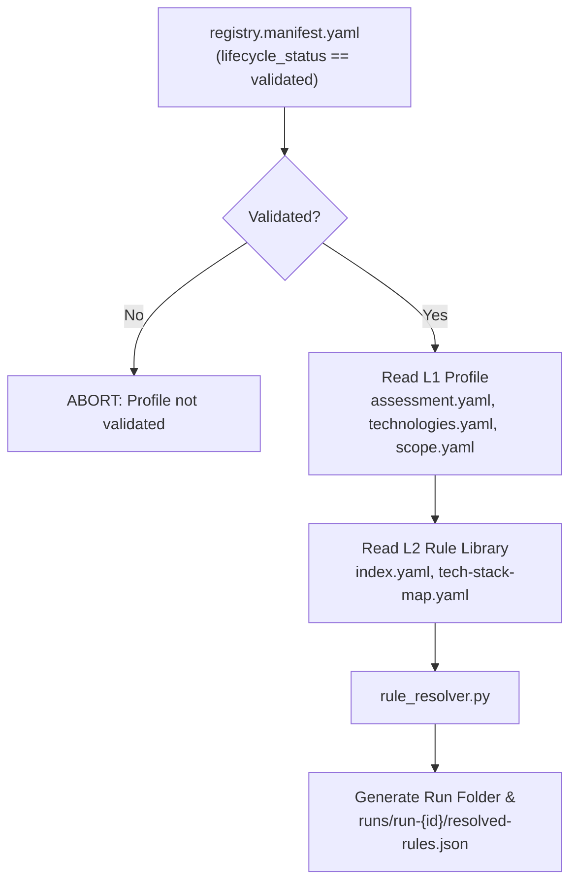

# Assessment Engine Blueprint

> **Status:** Active — Layer 3 canonical reference.  
> **Last updated:** 2026-07-24  
> **Parent:** [ARCHITECTURE-BLUEPRINT.md](../ARCHITECTURE-BLUEPRINT.md) §Layer 3  
> **Previous Layer:** [2.3 Rule Library/BLUEPRINT.md](../2.%20Security%20Knowledge%20Base%20%E2%AD%90%20%28Core%20Asset%29/2.3%20Rule%20Library/BLUEPRINT.md)  
> **Scope:** Engine modules, Rule Resolver, scanner orchestration, findings normalization, and run outputs.

---

## 1. Role

**Assessment Engine** (`3. Assessment Engine`) là Layer 3 của ASRP — motor thực thi chuyển đổi **"Profile dự án (Layer 1) + Quy tắc bảo mật (Layer 2)"** thành **"Findings + Evidences (Kết quả đánh giá)"**.

**Trách nhiệm:**

- Đọc và xác thực Human Gate (`registry.manifest.yaml`).
- Tự động clone mã nguồn, ghim commit SHA (`3.1 Source Acquisition`).
- Thiết lập không gian làm việc cách ly (`3.2 Workspace`).
- Thực thi **Rule Resolver** hợp nhất profile L1 và rules L2 thành `resolved-rules.json` (`3.4 Rule Evaluation`).
- Điều phối các scanner tools (`semgrep`, `gitleaks`, `trivy`, `checkov`) và `3.5 AI Reviewer`.
- Chuẩn hóa kết quả quét thành định dạng Findings thống nhất (`3.6 Findings`).

---

## 2. Submodules & Folder Structure

```
3. Assessment Engine/
├── BLUEPRINT.md                        # Layer 3 canonical blueprint (file này)
├── 3.1 Source Acquisition/             # Clone repo & commit SHA pinning
├── 3.2 Workspace/                      # Isolate workspace structure
├── 3.3 Evidence Collection/           # Code snippet & raw log collector
├── 3.4 Rule Evaluation/                # Rule Resolver & Tool Orchestrator
│   └── rule_resolver.py                # Core Rule Resolver CLI Tool
├── 3.5 AI Reviewer/                    # Business Logic & Auth Flow LLM Agent
├── 3.6 Findings/                       # Findings Normalizer & Schema
├── 3.7 Risk Assessment/                # Risk scoring & Business Impact
└── 3.8 Report Generator/               # Reporting data preparer
```

---

## 3. Rule Resolver Execution Flow



---

## 4. Run Output Contract (`resolved-rules.json`)

Tệp `resolved-rules.json` được sinh tại `1. Projects Registry/{project_id}/runs/run-{timestamp}/resolved-rules.json` có định dạng:

```json
{
  "run_id": "run-20260724-170000",
  "project_id": "cleverdent",
  "resolved_at": "2026-07-24T17:00:00Z",
  "manifest_hash": "sha256:764c02cb...",
  "rules_count": 12,
  "engines_summary": {
    "gitleaks": 4,
    "semgrep": 5,
    "trivy": 2,
    "checkov": 0,
    "cicd": 0,
    "custom_ai": 1
  },
  "rules": [ ... ]
}
```
