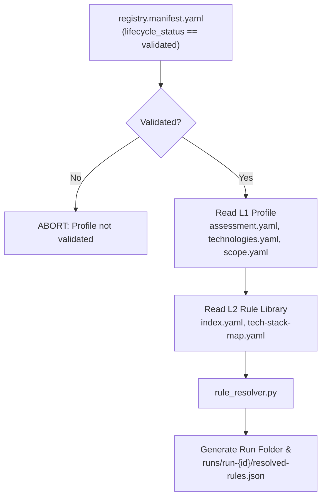

# Assessment Engine Blueprint

> **Status:** Active — Layer 3 canonical reference.  
> **Last updated:** 2026-07-24  
> **Parent:** [ARCHITECTURE-BLUEPRINT.md](../ARCHITECTURE-BLUEPRINT.md) §Layer 3  
> **Previous Layer:** [2.3 Rule Library/BLUEPRINT.md](../2.%20Security%20Knowledge%20Base%20%E2%AD%90%20%28Core%20Asset%29/2.3%20Rule%20Library/BLUEPRINT.md)  
> **Scope:** Engine modules, Rule Resolver, scanner orchestration, findings normalization, and run outputs.

---

## 1. Role

**Assessment Engine** (`3. Assessment Engine`) là Layer 3 của ASRP — motor thực thi chuyển đổi **"Profile dự án (Layer 1) + Quy tắc bảo mật (Layer 2)"** thành **"Findings + Evidences (Kết quả đánh giá)"**.

**Trách nhiệm:**

- Đọc và xác thực Human Gate (`registry.manifest.yaml`).
- Tự động clone mã nguồn, ghim commit SHA (`3.1 Source Acquisition`).
- Thiết lập không gian làm việc cách ly (`3.2 Workspace`).
- Thực thi **Rule Resolver** hợp nhất profile L1 và rules L2 thành `resolved-rules.json` (`3.4 Rule Evaluation`).
- Điều phối các scanner tools (`semgrep`, `gitleaks`, `trivy`, `checkov`) và `3.5 AI Reviewer`.
- Chuẩn hóa kết quả quét thành định dạng Findings thống nhất (`3.6 Findings`).

---

## 2. Submodules & Folder Structure

```
3. Assessment Engine/
├── BLUEPRINT.md                        # Layer 3 canonical blueprint (file này)
├── 3.1 Source Acquisition/             # Clone repo & commit SHA pinning
├── 3.2 Workspace/                      # Isolate workspace structure
├── 3.3 Evidence Collection/           # Code snippet & raw log collector
├── 3.4 Rule Evaluation/                # Rule Resolver & Tool Orchestrator
│   └── rule_resolver.py                # Core Rule Resolver CLI Tool
├── 3.5 AI Reviewer/                    # Business Logic & Auth Flow LLM Agent
├── 3.6 Findings/                       # Findings Normalizer, Scan Validator & Schema
│   ├── findings_normalizer.py
│   └── scan_validator.py               # Step 2 DoD enforcement
├── 3.7 Risk Assessment/                # Risk scoring & Business Impact
└── 3.8 Report Generator/               # Reporting data preparer
```

---

## 3. Rule Resolver Execution Flow



---

## 4. Run Output Contract (`resolved-rules.json`)

Tệp `resolved-rules.json` được sinh tại `1. Projects Registry/{project_id}/runs/run-{timestamp}/resolved-rules.json` có định dạng:

```json
{
  "run_id": "run-20260724-170000",
  "project_id": "cleverdent",
  "resolved_at": "2026-07-24T17:00:00Z",
  "manifest_hash": "sha256:764c02cb...",
  "rules_count": 12,
  "engines_summary": {
    "gitleaks": 4,
    "semgrep": 5,
    "trivy": 2,
    "checkov": 0,
    "cicd": 0,
    "custom_ai": 1
  },
  "rules": [ ... ]
}
```

**Bổ sung (2026-09):** `scan_scope` block (include/exclude, per-component clone paths) và `component_id` trên từng rule khi resolve per-component.

---

## 5. Scan Context Contract (`scan_context.json`)

AI pre-flight artifact sinh cùng run folder:

```json
{
  "project_id": "cleverdent",
  "run_id": "run-...",
  "manifest_hash": "sha256:...",
  "components": [{ "id", "scan_paths", "exclude_paths", "clone_path" }],
  "technologies": [{ "component_id", "language", "framework", "rule_set_ids" }],
  "context": { "risk_tier", "business", "compliance", "data_classification" },
  "assessment": { "standards", "security_domains", "tools_enabled", "ai", "severity_threshold" },
  "resolved_rules_by_component": { "dent-api-nestjs": ["ASRP-SEC-001"] },
  "resolved_rule_count": 15
}
```

---

## 6. Rule Set Filtering

`rule_resolver.py` lọc rules từ `index.yaml` theo:

- Union `assessment.rule_set_ids` + per-component `technologies[].rule_set_ids`
- Alias expansion qua `2.3 Rule Library/mappings/rule-set-map.yaml`
- Framework normalization (`nestjs (v9.4.3) / express` → `{nestjs, express}`)
- `tools_enabled` gates

---

## 7. Scanner Orchestrator — Clone-Based Scanning

`scanner_orchestrator.py` quét clone root `clones/{project_id}/{component_id}/` (một lần per component). Raw outputs: `raw_outputs/{component_id}/{engine}_raw.json`. Respects `assessment.tools_enabled`. Default: empty `_meta` placeholder khi native tool không có. **`--allow-emulated` không inject fake file paths** — chỉ dùng cho dev smoke test; evidence thật cần native tools (`gitleaks`, `semgrep`, `trivy`). `execution_summary.json` báo `emulated_by_engine`, `tools_enabled`, `allow_emulated`.

## 7.1 Source Acquisition — Synthetic Demo Guard

`source_acquisition.py` → `populate_workspace_files()`:

- **Production projects** (`cleverdent`, …): không seed Python demo khi clone đã có source markers (`package.json`, `.git`, …).
- **Auto-cleanup**: xóa `app/main.py`, `config/settings.py`, `requirements.txt` nếu khớp ASRP demo signature (legacy pollution).
- **Demo lane only**: `demo-*` / `test-app` projects với workspace trống mới nhận seeded FastAPI sample.
- `acquisition_metadata.json` ghi `synthetic_files_injected` / `synthetic_files_removed` per component.

---

## 8. Scan Validator (Step 2 DoD)

`scan_validator.py` — invoked via `python asrp.py validate --stage scan --run-id {run_id}` (`--strict` for CI).

**Checks:** 12 stage files + findings.json schema; summary integrity; anti copy-paste; forbid `FND-*` item_ids; consolidation completeness; `manifest_hash` freshness vs `registry.manifest.yaml`; emulated-only raw outputs when `tools_enabled` (warning default, error with `--strict`).

**Findings normalizer:** merge mode — append raw hits to AI `findings.json`, dedupe by rule_id+location, filter by `severity_threshold`, emit `components_summary`. **Skips supplementary merge when `all_engines_emulated`**; strips findings on ASRP demo seed paths (`app/main.py`, `config/settings.py`, …) unless `finding_id` is AI-primary (`FND-*`).

**Stage overlap semantics:** Cùng vulnerability được phép FAIL ở nhiều stage với catalog `item_id` khác nhau; dedupe chỉ ở `findings.json`. Copy-paste toàn bộ `results[]` sang nhiều stage → FAIL.

---
