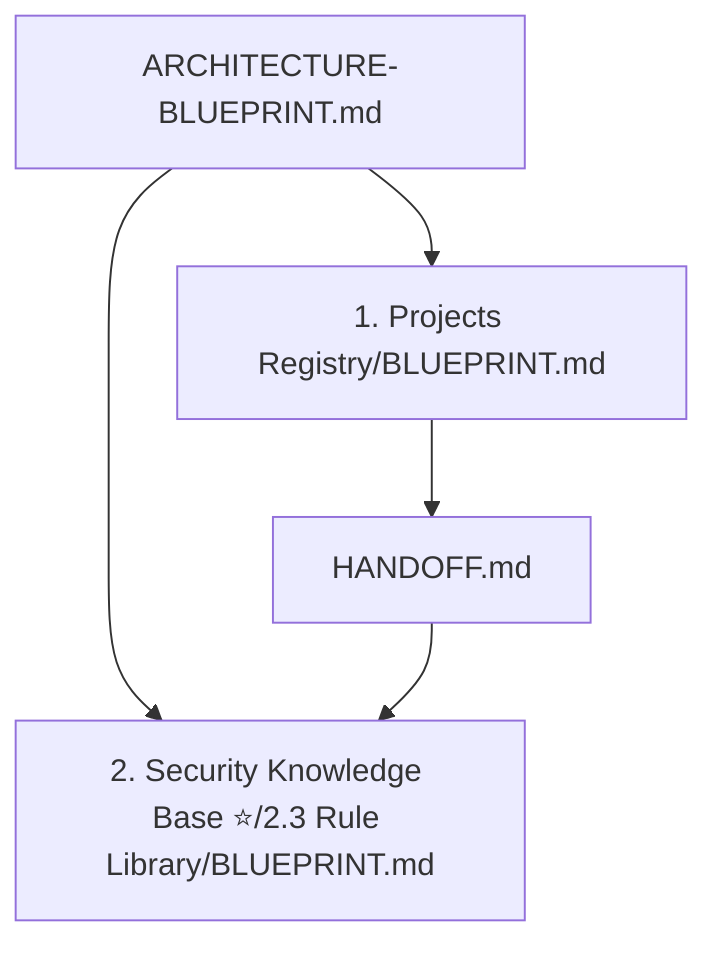
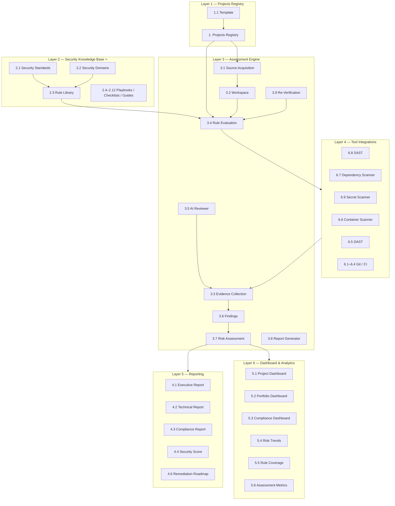
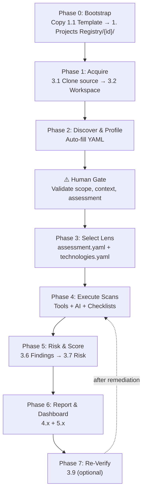
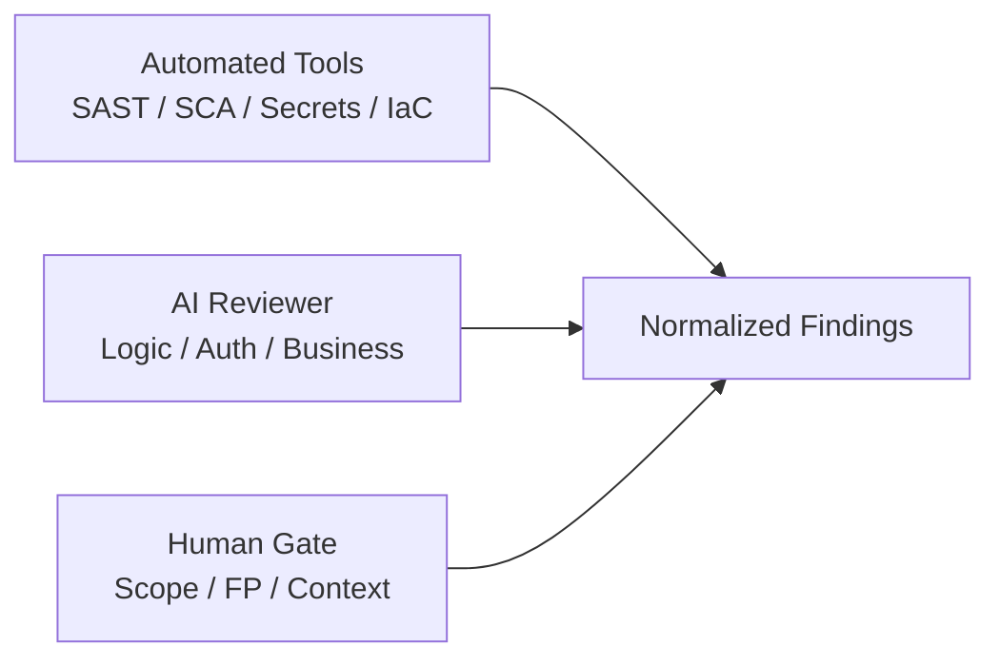

# ASRP Architecture Blueprint

> **Status:** Active — canonical overview for platform architecture.  
> **Last updated:** 2026-07-22  
> **Scope:** Main flow, 6-layer architecture, data contracts, blueprint hierarchy, and implementation roadmap.

---

## 0. Documentation Governance

**Quy tắc bắt buộc cho toàn bộ dự án ASRP:**

- **Canonical overview:** `ARCHITECTURE-BLUEPRINT.md` (file này) — bức tranh tổng thể 6 layer
- **Layer blueprints:** mỗi layer một file riêng với contract chi tiết (không duplicate vào overview)
- **Handoff:** [`HANDOFF.md`](HANDOFF.md) — việc cần làm cho layer tiếp theo
- **Sync rule:** Mọi thay đổi cấu trúc/contract sau khi chốt và implement **PHẢI** được cập nhật vào layer blueprint tương ứng, rồi sync summary về `ARCHITECTURE-BLUEPRINT.md`



### Layer Blueprint Index

| Layer | Blueprint | Status |
|-------|-----------|--------|
| L1 — Projects Registry | [1. Projects Registry/BLUEPRINT.md](1.%20Projects%20Registry/BLUEPRINT.md) | **Done** |
| L2 — Rule Library | [2.3 Rule Library/BLUEPRINT.md](2.%20Security%20Knowledge%20Base%20%E2%AD%90%20%28Core%20Asset%29/2.3%20Rule%20Library/BLUEPRINT.md) | **Done** |
| L3 — Assessment Engine | [3. Assessment Engine/BLUEPRINT.md](3.%20Assessment%20Engine/BLUEPRINT.md) | **Done** (Resolver, Orchestrator, Normalizer, Risk Assessor) |
| L4 — Integrations | — | Planned |
| L5 — Reporting | [5. Reporting/BLUEPRINT.md](5.%20Reporting/BLUEPRINT.md) | **Done** (Executive HTML & MD Report Generator) |
| L6 — Dashboard & Analytics | — | Planned |

---

## 1. Vision

**Application Security Review Platform (ASRP)** là nền tảng **"Security Review as Code"**:

- Clone source code của một dự án vào workspace
- Tự động hiểu dự án (tech stack, kiến trúc, scope, compliance context)
- Đánh giá bảo mật theo các tiêu chuẩn quốc tế và rule nội bộ
- Sinh output có giá trị audit: báo cáo, dashboard, evidence, remediation roadmap

**Mục tiêu:** `clone → profile → scan → report` với ít thao tác thủ công nhất, nhưng vẫn đủ tin cậy cho security review thực tế.

**Nguyên tắc thiết kế:**

| Nguyên tắc | Mô tả |
|------------|-------|
| Hybrid review | Tools (~40–60%) + AI Reviewer (~20–30%) + Human gate (~10–20%) |
| Assessment lens | Không scan "full ASVS" mặc định — scope qua `assessment.yaml` |
| Evidence-first | Mọi finding phải có evidence để audit và re-verify |
| One project = one folder | Mỗi dự án là instance từ `1.1 Template` |
| Knowledge ≠ Rules | Concept KB (lý thuyết) tách biệt Rule Library (executable) |

---

## 2. Six-Layer Architecture (Bức tranh lớn)



---

### Layer 1 — Projects Registry (`1. Projects Registry`)

**Vai trò:** Hồ sơ dự án — mọi thông tin engine cần biết trước khi scan.

**Chi tiết:** xem [1. Projects Registry/BLUEPRINT.md](1.%20Projects%20Registry/BLUEPRINT.md)

**Tóm tắt:**

- 8 YAML files: 7 profile + `registry.manifest.yaml` (human gate)
- JSON Schemas tại `1. Projects Registry/schema/`
- Lifecycle: `draft → profiled → validated → scanning → completed`
- Example instance: `cleverdent/` (validated)
- Engine rule: không scan khi `lifecycle_status != validated`

---

### Layer 2 — Security Knowledge Base (`2. Security Knowledge Base` ⭐)

**Vai trò:** Bộ não bảo mật của platform — cung cấp standards reference, domain taxonomy, và executable rules.

**Hai loại tài sản (tách biệt):**

```
┌─────────────────────────────────────────────────────────────┐
│  KNOWLEDGE (concept)          RULES (executable)            │
│  ───────────────────          ──────────────────            │
│  Security Knowledge Base/     ASRP/2.3 Rule Library         │
│  knowledge/                   • Semgrep / custom patterns   │
│  • Theory, concepts           • Trivy / scanner policies    │
│  • OWASP explanations         • Checklist items with IDs    │
│  • Best practices             • Standard requirement mapping │
│  • AI/RAG reference           • Remediation guidance links  │
└─────────────────────────────────────────────────────────────┘
```

**Cấu trúc mục tiêu:**

| Folder | Nội dung |
|--------|----------|
| `2.1 Security Standards` | OWASP ASVS, Top 10, WSTG, NIST SSDF, CWE, CAPEC, CIS… |
| `2.2 Security Domains` | Auth, API, Secrets, Crypto, Session, Input Validation… |
| `2.3 Rule Library` | **Executable rules** — trái tim của auto-scan |
| `2.4–2.12` | Checklists, Playbooks, Threat Models, Remediation Guides… |

**Canonical knowledge home:** `Security Knowledge Base/knowledge/` (concept layer, One Concept = One Home).

---

### Layer 3 — Assessment Engine (`3. Assessment Engine`)

**Vai trò:** Motor thực thi — biến "project profile + rules" thành "findings + evidence".

| Module | Chức năng |
|--------|-----------|
| `3.1 Source Acquisition` | Clone repo, pin commit SHA, lưu acquisition metadata |
| `3.2 Workspace` | Phân loại artifacts: source, config, IaC, deps, secrets, API spec, docs |
| `3.3 Evidence Collection` | Lưu file:line, snippet, tool raw output, hash |
| `3.4 Rule Evaluation` | Chạy rules đã chọn theo assessment lens |
| `3.5 AI Reviewer` | Review logic flaws, auth flow, business logic gaps |
| `3.6 Findings` | Chuẩn hóa kết quả: severity, CWE, standard mapping, status |
| `3.7 Risk Assessment` | Scoring, prioritization, business impact |
| `3.8 Report Generator` | Sinh báo cáo từ findings + evidence |
| `3.9 Re-Verification` | Scan lại sau remediation, so sánh delta |

**Workspace buckets (`3.2`):**

```
3.2 Workspace/
├── 3.2.1 Source Code/
├── 3.2.2 Architecture/
├── 3.2.3 Configuration/
├── 3.2.4 Infrastructure/
├── 3.2.5 Dependencies/
├── 3.2.6 Secrets/
├── 3.2.7 API Specification/
└── 3.2.8 Documentation/
```

---

### Layer 4 — Tool Integrations (`6. Integrations`)

**Vai trò:** Tay chân thực thi — engine orchestrate tools, không tự implement mọi scanner.

| Integration | Tool examples | Coverage |
|-------------|---------------|----------|
| `6.8 SAST` | Semgrep, CodeQL | Code patterns, injection, XSS |
| `6.7 Dependency Scanner` | Trivy, npm audit, Snyk | CVE, vulnerable packages |
| `6.9 Secret Scanner` | Gitleaks, TruffleHog | Hardcoded credentials |
| `6.6 Container Scanner` | Trivy, Grype | Image vulnerabilities |
| `6.5 DAST` | OWASP ZAP, Burp (CI) | Runtime vulnerabilities (optional) |
| `6.1–6.4 Git / CI` | GitHub, GitLab, Bitbucket, CI hooks | Trigger, webhook, PR comments |

**Nguyên tắc:** Tools output → normalize → findings. AI Reviewer bổ sung phần tools không cover.

---

### Layer 5 — Reporting (`4. Reporting`)

**Vai trò:** Output cho stakeholder khác nhau.

| Report | Audience | Nội dung chính |
|--------|----------|----------------|
| `4.1 Executive Report` | Leadership | Risk summary, score, top issues |
| `4.2 Technical Report` | Engineers | Findings detail, evidence, fix guidance |
| `4.3 Compliance Report` | Audit / Compliance | Mapping findings → standard requirements |
| `4.4 Security Score` | All | Quantified posture (per domain, per standard) |
| `4.5 Findings Dashboard` | Security team | Interactive findings view |
| `4.6 Remediation Roadmap` | PM / Engineering | Prioritized fix plan |

---

### Layer 6 — Dashboard & Analytics (`5. Dashboard & Analytics`)

**Vai trò:** Visibility liên tục across projects và assessment runs.

| Dashboard | Mục đích |
|-----------|----------|
| `5.1 Project Dashboard` | Findings, score, open issues per project |
| `5.2 Portfolio Dashboard` | Cross-project comparison |
| `5.3 Compliance Dashboard` | % coverage per standard (ASVS, Top 10…) |
| `5.4 Risk Trends` | Score/findings trend over time |
| `5.5 Rule Coverage` | Rules executed vs. applicable |
| `5.6 Assessment Metrics` | Run duration, tool coverage, FP rate |

---

## 3. Main Flow (End-to-End)



### Phase 0 — Bootstrap

1. Copy `1.1 Template/` → `1. Projects Registry/{project-id}/`
2. Khai báo sơ bộ: repo URL, branch, owner trong `project.yaml` và `components.yaml`

### Phase 1 — Acquire

1. Clone source vào `3.1 Source Acquisition` / per-project workspace
2. Pin commit SHA
3. Normalize vào `3.2 Workspace` buckets

### Phase 2 — Discover & Profile

1. Auto-detect: `package.json`, `pom.xml`, `go.mod`, `Dockerfile`, `k8s/`, `.env.example`…
2. Auto-fill draft: `technologies.yaml`, `components.yaml`, `architecture.yaml`
3. **Human gate:** validate `scope.yaml`, `context.yaml`, `assessment.yaml`

### Phase 3 — Select Assessment Lens

1. Đọc `assessment.yaml` → chọn standards, domains, rule_sets
2. Đọc `technologies.yaml` → map stack → applicable rules
3. Resolve final rule list từ `2.3 Rule Library`

### Phase 4 — Execute Scans

Chạy song song:

- **Tool layer** (SAST, SCA, Secrets, IaC…)
- **AI Reviewer** (logic, auth flow, missing controls)
- **Checklists** (manual QA items nếu có)

Output → `3.3 Evidence Collection` → `3.6 Findings`

### Phase 5 — Risk & Score

1. Normalize findings: severity, CWE, standard mapping
2. Risk scoring: severity × exploitability × business impact
3. Prioritize remediation

### Phase 6 — Report & Dashboard

1. Generate reports (`4.1`–`4.6`)
2. Update dashboards (`5.1`–`5.6`)

### Phase 7 — Re-Verify (optional)

1. Sau khi fix → trigger re-scan
2. So sánh delta: fixed, new, regressed findings

---

## 4. Core Data Contracts

Các entity tối thiểu để các layer giao tiếp với nhau.

### 4.1 AssessmentRun

```yaml
assessment_run:
  id: "run-2026-07-22-001"
  project_id: "cleverdent"
  commit_sha: "abc123def456"
  branch: "main"
  started_at: "2026-07-22T10:00:00Z"
  completed_at: "2026-07-22T10:45:00Z"
  status: completed  # pending | running | completed | failed
  lens:
    standards: ["OWASP Top 10", "OWASP ASVS L1"]
    domains: ["Authentication", "API Security", "Secrets Management"]
    rule_sets: ["owasp-top10-2021", "python-secure-coding"]
  tool_versions:
    semgrep: "1.45.0"
    gitleaks: "8.18.0"
    trivy: "0.48.0"
```

### 4.2 Finding

```yaml
finding:
  id: "F-001"
  run_id: "run-2026-07-22-001"
  title: "Hardcoded API key in configuration"
  description: "API key found in source code without environment variable wrapper."
  severity: high  # critical | high | medium | low | info
  confidence: high  # high | medium | low
  cwe: "CWE-798"
  standard_mapping:
    - "OWASP Top 10:2021-A07"
    - "OWASP ASVS:2.10.1"
  domain: "Secrets Management"
  location:
    file: "src/config/settings.py"
    line_start: 42
    line_end: 42
  evidence_id: "E-001"
  source: gitleaks  # tool name or "ai-reviewer" or "manual"
  status: open  # open | fixed | false_positive | accepted_risk | wont_fix
  remediation: "Move API key to environment variable or secret manager."
```

### 4.3 Evidence

```yaml
evidence:
  id: "E-001"
  finding_id: "F-001"
  type: tool_output  # tool_output | code_snippet | screenshot | manual_note
  source: gitleaks
  content_ref: "evidence/run-2026-07-22-001/E-001-gitleaks.json"
  snippet: 'api_key = "sk-live-xxxxxxxx"'
  hash: "sha256:abc123..."
  collected_at: "2026-07-22T10:15:00Z"
```

### 4.4 Rule (executable)

```yaml
rule:
  id: "RULE-SEC-001"
  name: "No hardcoded secrets"
  description: "Detect hardcoded API keys, passwords, tokens in source code."
  domain: "Secrets Management"
  standard_mapping:
    - "OWASP Top 10:2021-A07"
    - "OWASP ASVS:2.10.1"
  severity: high
  engine: gitleaks  # semgrep | gitleaks | trivy | custom | ai-prompt
  engine_config:
  pattern_ref: "rules/secrets/hardcoded-api-key.yaml"
  applicable_technologies:
    - "python"
    - "javascript"
    - "java"
  enabled: true
```

---

## 5. Hybrid Scan Model

Platform thiết kế **hybrid** từ đầu — không hứa 100% automated full standard coverage.

| Layer | Coverage ước tính | Ví dụ phát hiện |
|-------|-------------------|-----------------|
| **Automated tools** | ~40–60% | Secrets, CVE, misconfig, known code patterns |
| **AI Reviewer** | ~20–30% | Auth flow gaps, missing validation, business logic flaws |
| **Human review** | ~10–20% | Scope decisions, false positive triage, business context |



---

## 6. Layer Mapping (ASRP Folder Tree)

| Layer | ASRP Path | Status |
|-------|-----------|--------|
| 1 — Projects Registry | `1. Projects Registry/` | **Done** — schemas, cleverdent instance, blueprint |
| 2 — Knowledge Base | `2. Security Knowledge Base/` + `Security Knowledge Base/knowledge/` | Concepts exist; Rule Library TBD |
| 3 — Assessment Engine | `3. Assessment Engine/` | Planned |
| 4 — Integrations | `6. Integrations/` | Planned |
| 5 — Reporting | `4. Reporting/` | Planned |
| 6 — Dashboard | `5. Dashboard & Analytics/` | Planned |

---

## 7. Implementation Roadmap

### Sprint 1 — Foundation

- [x] Chuẩn hóa project template YAML + JSON Schema
- [x] Tạo project instance đầu tiên (`cleverdent`)
- [x] Viết PROJECTS-REGISTRY-BLUEPRINT.md + HANDOFF.md
- [ ] Định nghĩa `findings.json` + `evidence` schema (file-based)

### Sprint 2 — Rule Library MVP

- [ ] Thiết kế rule format + folder structure (`2.3 Rule Library/`)
- [ ] 20–50 rules map OWASP Top 10
- [ ] Rule mapping trong `technologies.yaml`

### Sprint 3 — Assessment Runner

- [ ] Orchestrator: đọc project YAML → resolve rules → chạy tools
- [ ] Integrate: Semgrep + Gitleaks + Trivy
- [ ] Normalize tool output → findings + evidence

### Sprint 4 — Report & Dashboard v1

- [ ] Report generator (Markdown / HTML)
- [ ] Project dashboard: severity chart, top findings, security score
- [ ] Assessment run history

### Sprint 5+

- [ ] AI Reviewer integration
- [ ] OWASP ASVS full mapping
- [ ] Portfolio dashboard
- [ ] CI/CD integration (GitHub Actions, PR comments)
- [ ] Re-verification workflow

---

## 8. Design Decisions (ADR summary)

| # | Decision | Rationale |
|---|----------|-----------|
| D1 | Tách Knowledge (concept) và Rule Library (executable) | KB markdown không thể chạy trực tiếp; rules cần format riêng |
| D2 | Human gate sau Phase 2 | Scope, compliance, assessment lens không thể auto-detect đáng tin |
| D3 | Assessment lens qua YAML | Tránh scan quá rộng; user chọn standards/domains phù hợp |
| D4 | Evidence-first findings | Audit trail và re-verification yêu cầu bằng chứng cụ thể |
| D5 | File-based data contracts (MVP) | Đơn giản, versionable, không cần DB ngay từ đầu |
| D6 | Hybrid scan model | Thực tế security review luôn cần human + AI + tools |
| D7 | Blueprint hierarchy | Overview (ARCHITECTURE) + layer blueprints + HANDOFF; sync sau mỗi implement |

---

## 9. Related Documents

| Document | Path |
|----------|------|
| Workspace layout | [`../README.md`](../README.md) |
| Layer 1 blueprint | [`PROJECTS-REGISTRY-BLUEPRINT.md`](PROJECTS-REGISTRY-BLUEPRINT.md) |
| Next layer handoff | [`HANDOFF.md`](HANDOFF.md) |
| Project template | [`1. Projects Registry/1.1 Template/`](1.%20Projects%20Registry/1.1%20Template/) |
| Project schemas | [`1. Projects Registry/schema/`](1.%20Projects%20Registry/schema/) |
| Example project | [`1. Projects Registry/cleverdent/`](1.%20Projects%20Registry/cleverdent/) |
| Knowledge Base taxonomy | [`../Security Knowledge Base/knowledge/README.md`](../Security%20Knowledge%20Base/knowledge/README.md) |
| KB writing rules | [`../Security Knowledge Base/docs/knowledge-base-document-rules.md`](../Security%20Knowledge%20Base/docs/knowledge-base-document-rules.md) |
| AppSec research pipeline | [`../Security Knowledge Base/docs/appsec-research-pipeline/README.md`](../Security%20Knowledge%20Base/docs/appsec-research-pipeline/README.md) |

---

## 10. Changelog

| Date | Change |
|------|--------|
| 2026-07-22 | Semantic YAML filenames in Projects Registry (no numeric prefix); bootstrap order in layer blueprint |
| 2026-07-22 | Layer 1 complete — Projects Registry blueprint, schemas, cleverdent instance, governance |
| 2026-07-22 | Initial draft — 6-layer architecture blueprint and main flow |
