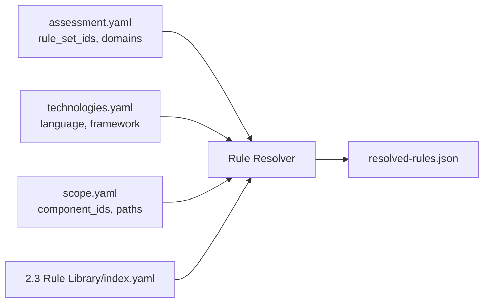

# ASRP Handoff — Layer 2

> **Status:** Active  
> **Last updated:** 2026-07-22  
> **Previous layer:** [PROJECTS-REGISTRY-BLUEPRINT.md](PROJECTS-REGISTRY-BLUEPRINT.md) (Layer 1 — Done)  
> **Next layer:** Layer 2 — Rule Library (`2.3`) + Rule Resolver

---

## 1. Context

Layer 1 (Projects Registry) đã hoàn thiện:

- 8 YAML profile files + JSON Schemas
- Lifecycle + human gate (`registry.manifest.yaml`)
- Example instance: `cleverdent/` (validated)
- Blueprint: [PROJECTS-REGISTRY-BLUEPRINT.md](PROJECTS-REGISTRY-BLUEPRINT.md)

Layer 2 là **blocker tiếp theo** trước khi Assessment Engine có thể chạy scan có ý nghĩa.

---

## 2. Next Layer Scope

**Primary:** `2. Security Knowledge Base ⭐ (Core Asset)/2.3 Rule Library`  
**Cross-cutting:** Rule Resolver (L1 profile + L2 rules → `resolved-rules.json`)

**Không block pipeline:**

- `2.1 Security Standards` — concept reference (markdown)
- `2.2 Security Domains` — taxonomy (markdown)
- KB concept tại `Security Knowledge Base/knowledge/` — đã có, dùng cho AI/RAG reference

---

## 3. Deliverables

| # | Deliverable | Mô tả | Input từ Layer 1 |
|---|-------------|-------|------------------|
| D1 | **Rule format YAML** | `rule.id`, `engine`, `applicable_technologies`, `standard_mapping`, `knowledge_ref` | — |
| D2 | **`2.3 Rule Library/index.yaml`** | Catalog tất cả rules: id, path, enabled, version | — |
| D3 | **MVP rules (20–50)** | OWASP Top 10 coverage: Semgrep, Gitleaks, Trivy | — |
| D4 | **`tech-stack-map.yaml`** | Map language/framework → `rule_set_ids` | `technologies.yaml` |
| D5 | **`owasp-top10-2021.yaml`** | Mapping rule_id → OWASP Top 10 categories | — |
| D6 | **Rule Resolver** | `assessment + technologies + scope → resolved-rules.json` | `assessment.yaml`, `technologies.yaml`, `scope.yaml` |
| D7 | **`resolved-rules.json` schema** | Output contract L1+L2 → L3.4 Rule Evaluation | `cleverdent/runs/{run_id}/` |
| D8 | **`RULE-LIBRARY-BLUEPRINT.md`** | Layer 2 blueprint (pattern giống Projects Registry) | — |

---

## 4. Rule Resolver — Core Logic



**Pseudo-logic:**

```
1. Read assessment.rule_set_ids + security_domains
2. Read technologies[].language, framework, rule_set_ids per component
3. Read scope.component_ids, include/exclude paths
4. Join with 2.3 Rule Library/index.yaml + tech-stack-map.yaml
5. Filter: enabled rules matching tech + scope + lens
6. Output resolved-rules.json to {project}/runs/{run_id}/
```

**Pre-condition:** `cleverdent/` must have `lifecycle_status: validated` and valid `registry.manifest.yaml`.

---

## 5. Suggested Folder Structure (Layer 2.3)

```
2. Security Knowledge Base ⭐ (Core Asset)/2.3 Rule Library/
├── index.yaml
├── by-domain/
│   ├── secrets/
│   ├── injection/
│   └── dependencies/
├── by-engine/
│   ├── semgrep/
│   ├── gitleaks/
│   └── trivy/
└── mappings/
    ├── owasp-top10-2021.yaml
    └── tech-stack-map.yaml
```

---

## 6. Layer I/O (L1 → L2 → L3)

| From | To | Artifact |
|------|----|----------|
| L1 | Rule Resolver | `technologies.yaml`, `scope.yaml`, `assessment.yaml` |
| L1 | Rule Resolver (gate) | `registry.manifest.yaml` |
| L2 | Rule Resolver | `2.3 Rule Library/index.yaml`, rule YAML files |
| Resolver | L3.4 | `resolved-rules.json` |
| L2 | L3.6 (findings) | `standard_mapping`, `knowledge_ref` per rule |

---

## 7. Acceptance Criteria (Layer 2 Done)

- [ ] `RULE-LIBRARY-BLUEPRINT.md` published
- [ ] `2.3 Rule Library/index.yaml` catalogs ≥20 enabled rules
- [ ] Rules cover OWASP Top 10 2021 categories (secrets, injection, XSS, misconfig, etc.)
- [ ] `tech-stack-map.yaml` maps `python` + `fastapi` → relevant rule sets
- [ ] Rule Resolver runs against `cleverdent/` validated profile
- [ ] Output `cleverdent/runs/run-{date}-001/resolved-rules.json` is valid per schema
- [ ] Each rule has `knowledge_ref` link to concept KB (where applicable)
- [ ] [HANDOFF.md](HANDOFF.md) updated with Layer 3 tasks
- [ ] [ARCHITECTURE-BLUEPRINT.md](ARCHITECTURE-BLUEPRINT.md) synced (Layer 2 status → Done)

---

## 8. Out of Scope (Layer 2)

- Assessment Engine orchestrator implementation (Layer 3)
- Actually running Semgrep/Gitleaks/Trivy (Layer 4 Integrations)
- AI Reviewer rules (Layer 3.5, Sprint 5+)
- Full OWASP ASVS mapping (incremental after Top 10 MVP)

---

## 9. Suggested Sprint Plan

| Sprint | Focus |
|--------|-------|
| Sprint 2a | Rule format + index.yaml + folder structure + RULE-LIBRARY-BLUEPRINT.md |
| Sprint 2b | 20–50 MVP rules (Gitleaks, Semgrep, Trivy) |
| Sprint 2c | Rule Resolver + resolved-rules.json schema + test with cleverdent |

---

## 10. Changelog

| Date | Change |
|------|--------|
| 2026-07-22 | Initial handoff from Layer 1 → Layer 2 |
