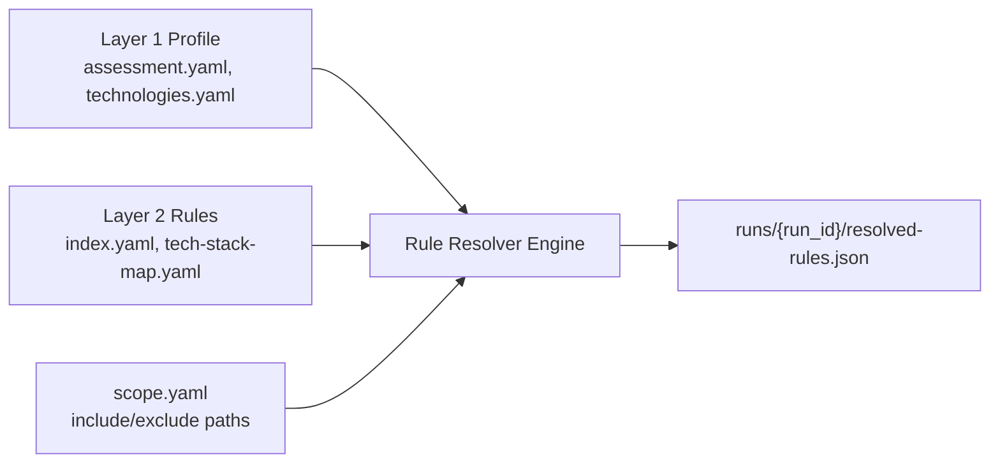

# ASRP Handoff — Layer 3: Assessment Engine & Rule Resolver

> **Status:** Active  
> **Last updated:** 2026-07-24  
> **Previous layer:** [2.3 Rule Library/BLUEPRINT.md](2.%20Security%20Knowledge%20Base%20%E2%AD%90%20%28Core%20Asset%29/2.3%20Rule%20Library/BLUEPRINT.md) (Layer 2 — Done)  
> **Next layer:** Layer 3 — Assessment Engine (`3. Assessment Engine`) & Rule Resolver Tool

---

## 1. Context

Layer 1 (Projects Registry) và Layer 2 (Rule Library) đã hoàn thiện 100%:

- **Layer 1:** 8 YAML profile files + JSON Schemas + Manifest Gate (`cleverdent/` validated instance).
- **Layer 2:** [BLUEPRINT.md](2.%20Security%20Knowledge%20Base%20%E2%AD%90%20%28Core%20Asset%29/2.3%20Rule%20Library/BLUEPRINT.md), Master Catalog `index.yaml` (19 Executable Rules), 6 Scanner Engines (`semgrep`, `gitleaks`, `trivy`, `checkov`, `cicd`, `custom_ai`), 8 Security Domains, và đầy đủ mappings OWASP Top 10 A01–A10.

Layer 3 là **Motor thực thi tiếp theo** biến "Profile + Rules" thành "Findings + Evidence".

---

## 2. Next Layer Scope (Layer 3 — Assessment Engine)

**Primary Modules:**
- `3.1 Source Acquisition` — Clone repo, checkout commit SHA, lưu acquisition metadata.
- `3.2 Workspace` — Phân loại source, config, IaC, secrets, dependencies.
- `3.4 Rule Evaluation / Rule Resolver` — Đọc profile Layer 1 + rules Layer 2 để xuất `resolved-rules.json` và gọi scanners.
- `3.5 AI Reviewer` — Thực thi các rule `custom_ai` đánh giá BOLA/IDOR và logic nghiệp vụ.
- `3.6 Findings` — Chuẩn hóa kết quả quét thành danh sách findings có CWE, Severity, Evidence.

---

## 3. Layer 3 Deliverables

| # | Deliverable | Mô tả | Input từ Layer 1 & 2 |
|---|-------------|-------|----------------------|
| D1 | **Rule Resolver CLI** | Tool tự động đọc profile L1 + rules L2 → sinh `resolved-rules.json` | `assessment.yaml`, `technologies.yaml`, `index.yaml` |
| D2 | **Source Acquisition Script** | Clone repo và pin SHA vào `runs/{run_id}/acquisition.json` | `components.yaml` |
| D3 | **Scanner Orchestrator** | Gọi Semgrep/Gitleaks/Trivy/Checkov chạy theo `resolved-rules.json` | `resolved-rules.json` |
| D4 | **Findings Normalizer** | Chuẩn hóa JSON raw output của scanner về schema ASRP Findings | Raw tool outputs |
| D5 | **`ASSESSMENT-ENGINE-BLUEPRINT.md`** | Bản thiết kế colocated tại `3. Assessment Engine/BLUEPRINT.md` | ARCHITECTURE-BLUEPRINT.md |

---

## 4. Rule Resolver — Core Execution Flow

---

## 5. Layer 2 Acceptance Criteria Checklist

- [x] [2.3 Rule Library/BLUEPRINT.md](2.%20Security%20Knowledge%20Base%20%E2%AD%90%20%28Core%20Asset%29/2.3%20Rule%20Library/BLUEPRINT.md) published.
- [x] `2.3 Rule Library/index.yaml` catalogs 19 enabled rules across 6 engines.
- [x] Rules cover full OWASP Top 10 2021 categories A01–A10.
- [x] `tech-stack-map.yaml` maps Python, JS/TS, Go, Java, Docker, Terraform, K8s.
- [x] Multi-Language Rule Design Standard persisted in [`.agents/AGENTS.md`](../.agents/AGENTS.md).
- [x] Directory READMEs created for `2.3 Rule Library/`, `by-engine/`, `by-domain/`, `mappings/`, `2.4 Review Checklists/`.
- [x] [ARCHITECTURE-BLUEPRINT.md](ARCHITECTURE-BLUEPRINT.md) synced (Layer 2 status → Done).

---

## 6. Changelog

| Date | Change |
|------|--------|
| 2026-07-24 | Layer 2 completed (19 Rules, 6 Engines, Multi-Lang Spec). Handoff to Layer 3 Assessment Engine. |
| 2026-07-22 | Initial handoff from Layer 1 → Layer 2 |
