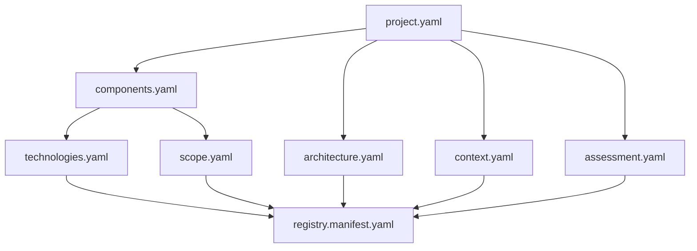
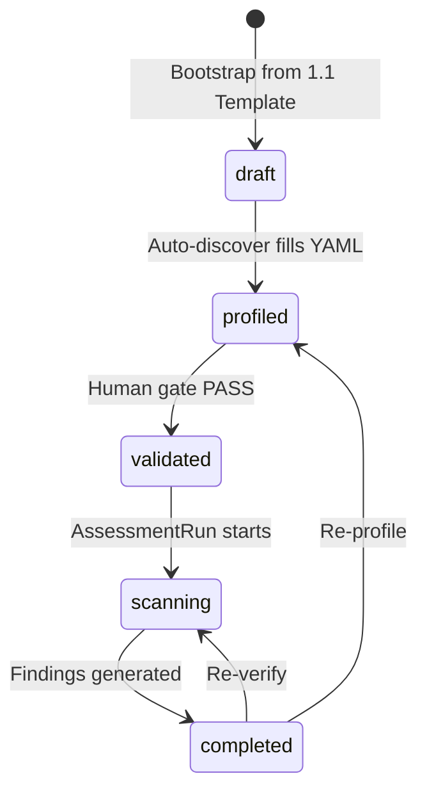

# Projects Registry Blueprint

> **Status:** Active — Layer 1 canonical reference.  
> **Last updated:** 2026-07-22  
> **Parent:** [ARCHITECTURE-BLUEPRINT.md](ARCHITECTURE-BLUEPRINT.md) §Layer 1  
> **Scope:** Project profile contracts, lifecycle, schemas, and layer I/O for Projects Registry.

---

## 1. Role

**Projects Registry** (`1. Projects Registry`) là Layer 1 của ASRP — nơi lưu **hồ sơ dự án** dưới dạng YAML có cấu trúc. Mọi assessment run đều bắt đầu từ profile này.

**Trách nhiệm:**

- Định danh dự án và component (repo, branch, path)
- Mô tả tech stack và kiến trúc (input cho rule mapping)
- Khai báo scope, context, compliance (human-reviewed)
- Cấu hình assessment lens (standards, domains, rule sets)
- Phát hành `registry.manifest.yaml` sau human gate — tín hiệu "ready to scan"

**Không thuộc Layer 1:** clone source code, chạy scanner, sinh findings, báo cáo.

---

## 2. Folder Structure

```
1. Projects Registry/
├── 1.1 Template/              # Starter template — không chỉnh sửa trực tiếp
│   ├── project.yaml
│   ├── components.yaml
│   ├── technologies.yaml      ⭐ Rule Mapping
│   ├── architecture.yaml
│   ├── scope.yaml
│   ├── context.yaml
│   ├── assessment.yaml
│   ├── registry.manifest.yaml
│   ├── documentation/
│   └── README.md
├── schema/                    # JSON Schema Draft 2020-12
│   ├── _definitions.json
│   ├── project.schema.json
│   ├── … (8 schemas total)
│   └── registry-manifest.schema.json
├── cleverdent/                # Example validated instance
│   ├── project.yaml … assessment.yaml
│   ├── registry.manifest.yaml
│   └── runs/                  # AssessmentRun output (Layer 3)
└── README.md
```

**Quy tắc:**

- Mỗi dự án = một folder kebab-case (`cleverdent/`, `my-app/`)
- Bootstrap: copy `1.1 Template/` → `{project-id}/`
- Template folder là read-only reference; chỉ sửa khi nâng schema version

---

## 3. Naming Conventions

| Loại | Convention | Ví dụ |
|------|------------|-------|
| Layer folder | `N. {Layer Name}` | `1. Projects Registry` |
| Template subfolder | `N.1 Template` | `1.1 Template` |
| YAML files | semantic `{topic}.yaml` | `technologies.yaml`, `registry.manifest.yaml` |
| Project instance | kebab-case | `cleverdent/` |
| `project_id` | kebab-case | `cleverdent` |
| `component_id` | kebab-case, project-scoped unique | `cleverdent-api` |
| `rule_set_id` | kebab-case | `owasp-top10-2021` |
| YAML root keys | snake_case, một wrapper mỗi file | `project:`, `scope:` |
| Docs subfolder | `documentation/` | không dùng `docs/` |

### 3.1 Bootstrap Order (priority)

Thứ tự ưu tiên khi điền profile — **không encode trong tên file**. Source of truth cho engine: `registry_manifest.profile_files`.

| Step | File | Mục đích | Phụ thuộc | Auto / Human |
|------|------|----------|-----------|--------------|
| 1 | `project.yaml` | Identity, lifecycle | — | Partial auto |
| 2 | `components.yaml` | Repo inventory | `project.id` | High auto |
| 3 | `technologies.yaml` | Tech stack + rule sets | `components[].id` | High auto |
| 4 | `architecture.yaml` | Auth, comms, data flow | `project.id` | Medium auto |
| 5 | `scope.yaml` | Include/exclude, review level | `components[].id` | **Human** |
| 6 | `context.yaml` | PII, compliance, risk tier | `project.id` | **Human** |
| 7 | `assessment.yaml` | Standards, domains, rule sets | `project.id` | **Human** |
| 8 | `registry.manifest.yaml` | Validation gate output | all 7 profile files | **Human** sign-off |

Steps 5–7 có thể làm song song sau khi có components và technologies.



---

## 4. File Contracts

| File | Root key | Mục đích | Auto-fill | Human required |
|------|----------|----------|-----------|----------------|
| `project.yaml` | `project` | Identity, lifecycle | Partial | owner, organization |
| `components.yaml` | `components` | Repo inventory, scan paths | High | ownership |
| `technologies.yaml` | `technologies` | Tech stack + `rule_set_ids` | High | custom libraries |
| `architecture.yaml` | `architecture` | Auth, comms, data flow | Medium | auth reality |
| `scope.yaml` | `scope` | Include/exclude, review level | Low | **Yes** |
| `context.yaml` | `context` | PII, compliance, risk tier | Low | **Yes** |
| `assessment.yaml` | `assessment` | Standards, domains, rule sets | Partial | **Yes** |
| `registry.manifest.yaml` | `registry_manifest` | Validation gate output | No | **Yes** (sign-off) |

### Linkage Fields (cross-file references)

| Field | Defined in | Referenced by |
|-------|------------|---------------|
| `project.id` | `project.yaml` | `project_id` in all other files |
| `components[].id` | `components.yaml` | `technologies[].component_id`, `scope.component_ids` |
| `rule_set_ids` | `technologies.yaml`, `assessment.yaml` | Layer 2.3 Rule Library (FK) |

**Application-level validation** (không enforce bởi JSON Schema đơn lẻ):

- Mọi `project_id` phải khớp `project.id`
- Mọi `component_id` trong `technologies` và `scope` phải tồn tại trong `components`
- `assessment.rule_set_ids` phải non-empty trước khi validate

---

## 5. Lifecycle & Human Gates



### Transition Criteria

| Transition | Criteria (tất cả phải pass) |
|------------|----------------------------|
| `draft → profiled` | `project.id` set; ≥1 component có `repository`; `technologies` entry cho mỗi component |
| `profiled → validated` | JSON Schema pass (7 profile files); `scope.review_level` set; `context.security` reviewed; `assessment.rule_set_ids` non-empty; human sign-off → `registry.manifest.yaml` |
| `validated → scanning` | `lifecycle_status = validated`; manifest exists; `profile_hash` matches current profile files |

### Engine Rule

> **Assessment Engine MUST NOT start a scan when `project.lifecycle_status != validated`.**

---

## 6. Input / Output Matrix

| Direction | Artifact | Format | Consumer Layer |
|-----------|----------|--------|----------------|
| **Input** (human/bootstrap) | repo URL, owner, compliance intent | manual → YAML | `components.yaml`, `context.yaml` |
| **Input** (auto-discover) | package.json, Dockerfile, go.mod, etc. | auto → YAML | `technologies.yaml`, `architecture.yaml` |
| **Output → L3.1** | Component inventory + clone spec | `components.yaml` | Source Acquisition |
| **Output → Rule Resolver** | Tech profile + assessment lens + scope | `technologies.yaml`, `scope.yaml`, `assessment.yaml` | Layer 2.3 + L3.4 |
| **Output → L3.7** | Business risk context | `context.yaml` (`risk_tier`) | Risk Assessment |
| **Output (gate)** | Validation proof | `registry.manifest.yaml` | Assessment Engine (pre-scan check) |
| **Output (runtime)** | Run artifacts placeholder | `runs/{run_id}/` | Layer 3 Assessment Engine |

---

## 7. JSON Schema

Schemas nằm tại [`schema/`](1.%20Projects%20Registry/schema/).

| Schema | Validates |
|--------|-----------|
| `project.schema.json` | `project.yaml` |
| `components.schema.json` | `components.yaml` |
| `technologies.schema.json` | `technologies.yaml` |
| `architecture.schema.json` | `architecture.yaml` |
| `scope.schema.json` | `scope.yaml` |
| `context.schema.json` | `context.yaml` |
| `assessment.schema.json` | `assessment.yaml` |
| `registry-manifest.schema.json` | `registry.manifest.yaml` |

Shared enums và patterns: [`schema/_definitions.json`](1.%20Projects%20Registry/schema/_definitions.json)

### Validation (manual, Sprint 1)

```bash
# Requires: pip install check-jsonschema
check-jsonschema --schemafile "1. Projects Registry/schema/project.schema.json" \
  "1. Projects Registry/cleverdent/project.yaml"
```

Cross-file linkage (project_id, component_id) được validate ở application level khi tạo manifest.

### Profile Hash

`profile_hash` = SHA-256 của concatenation (theo `profile_files` order) của 7 profile files:

```
project.yaml + components.yaml + … + assessment.yaml
```

Format: `sha256:{64-char-hex}`

---

## 8. Bootstrap Procedure

1. **Copy template**
   ```bash
   cp -r "1. Projects Registry/1.1 Template" "1. Projects Registry/{project-id}"
   ```
2. **Fill identity** — `project.yaml`: set `id`, `name`, `owner` (`lifecycle_status: draft`)
3. **Declare components** — `components.yaml`: repo URL, branch, paths
4. **Acquire & discover** (Layer 3.1, optional at this stage) — auto-fill `technologies.yaml`, `architecture.yaml`
5. **Set lifecycle** — update `lifecycle_status: profiled`
6. **Human review** — validate and fill `scope.yaml`, `context.yaml`, `assessment.yaml`
7. **Validate schemas** — all 7 profile files pass JSON Schema
8. **Create manifest** — generate `registry.manifest.yaml` with `profile_hash`, set `lifecycle_status: validated`
9. **Ready** — Assessment Engine may start runs under `runs/`

**Reference instance:** [`cleverdent/`](1.%20Projects%20Registry/cleverdent/)

---

## 9. Related Documents

| Document | Path |
|----------|------|
| Architecture overview | [ARCHITECTURE-BLUEPRINT.md](ARCHITECTURE-BLUEPRINT.md) |
| Next layer handoff | [HANDOFF.md](HANDOFF.md) |
| Layer README | [1. Projects Registry/README.md](1.%20Projects%20Registry/README.md) |
| Template README | [1.1 Template/README.md](1.%20Projects%20Registry/1.1%20Template/README.md) |

---

## 10. Changelog

| Date | Change |
|------|--------|
| 2026-07-22 | Initial Layer 1 blueprint — schemas, lifecycle, I/O matrix, cleverdent instance |
| 2026-07-22 | Semantic YAML filenames (no numeric prefix); bootstrap order documented in §3.1 |
