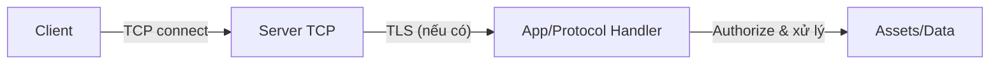

# TCP

## Mục tiêu

- Hiểu nền tảng `TCP` (connection-oriented, reliable delivery) để map `trust boundary` và tài nguyên cần bảo vệ trong security review.
- Nhận diện các nhóm threat/vulnerability thường xuất phát từ việc `TCP` tạo và duy trì state cho từng connection.

## Kiến thức nền

`TCP (Transmission Control Protocol)` là giao thức tầng Transport (`Layer 4`) trong mô hình OSI, dùng để truyền dữ liệu đáng tin cậy giữa hai thiết bị trên mạng.

Nói đơn giản:

- `IP` đưa gói tin đến đúng địa chỉ.
- `TCP` đảm bảo dữ liệu đến đúng, đủ, đúng thứ tự và hạn chế mất dữ liệu thông qua cơ chế xác nhận và truyền lại.

### Ví dụ thực tế

Giả sử bạn gửi một file PDF `100 MB` qua Internet.

Nếu chỉ dùng `IP`:

- File bị chia thành nhiều gói.
- Có thể mất gói.
- Có thể đến sai thứ tự.
- Bên nhận không biết có thiếu dữ liệu hay không.

Với `TCP`, các vấn đề này được xử lý theo cơ chế:

- Chia dữ liệu thành nhiều `segment`.
- Đánh số thứ tự `sequence number` cho từng segment.
- Xác nhận đã nhận (qua `ACK`) và truyền lại khi thiếu.
- Ghép lại đúng thứ tự tại bên nhận.

### TCP hoạt động như thế nào?

`TCP` có nhiều cơ chế liên quan đến vòng đời kết nối và truyền dữ liệu. Về mặt khái niệm, có thể gom thành 5 nhóm:

1. `Three-way Handshake` (thiết lập kết nối)
2. Truyền dữ liệu (segment hóa)
3. `ACK (Acknowledgement)` (xác nhận)
4. `Retransmission` (truyền lại khi thiếu)
5. `Four-way Handshake` (đóng kết nối)

#### Three-way Handshake (thiết lập kết nối)

Trước khi gửi dữ liệu, `TCP` phải tạo kết nối.

Client                 Server

SYN  ------------>

<------------ SYN + ACK

ACK  ------------>

Ý nghĩa:

- Client: "Tôi muốn kết nối."
- Server: "Được, tôi đồng ý."
- Client: "OK, bắt đầu truyền."

#### Truyền dữ liệu (segment hóa)

Ví dụ `Hello World`.

`TCP` chia dữ liệu thành các `segment` (khái niệm cơ bản):

- `Sequence Number`
- `Payload`
- `Checksum`

#### ACK (Acknowledgement)

Sau khi nhận dữ liệu, phía nhận gửi:

- `ACK = <next byte expected>` (xác nhận đã nhận tới một vị trí trong byte stream)

Nếu `ACK` không đến, bên gửi sẽ truyền lại phần bị thiếu (`retransmission`).

#### Retransmission

Ví dụ:

- Packet 1 ✔
- Packet 2 ❌
- Packet 3 ✔

Server báo thiếu packet 2, `TCP` chỉ gửi lại phần bị mất.

#### Four-way Handshake (đóng kết nối)

Client             Server

FIN  ------------>

<----------- ACK

<----------- FIN

ACK  ------------>

### TCP Header (những trường quan trọng)

Một `TCP packet` gồm:

- Source Port
- Destination Port
- Sequence Number
- Acknowledgement Number
- Flags
- Window Size
- Checksum
- Data

Hai nhóm trường quan trọng trong security review:

- `Source Port` và `Destination Port`: giúp định danh luồng ứng dụng tương ứng.
- `Sequence Number` và `Acknowledgement Number`: giúp `TCP` sắp xếp đúng thứ tự và xác nhận đã nhận.

### Flags

| Flag  | Ý nghĩa                       |
| ----- | ----------------------------- |
| `SYN` | Bắt đầu kết nối               |
| `ACK` | Xác nhận                      |
| `FIN` | Đóng kết nối (graceful close) |
| `RST` | Reset kết nối                 |
| `PSH` | Đẩy dữ liệu ngay              |
| `URG` | Dữ liệu khẩn                  |

### TCP đảm bảo điều gì?

Reliable Delivery

- Nếu mất packet ⇒ gửi lại.

Ordered Delivery

- `TCP` sắp xếp thành thứ tự đúng để ứng dụng không phải tự "vá" thứ tự.

Error Checking

- `TCP` dùng `Checksum` để phát hiện lỗi dữ liệu.
- Nếu checksum không khớp ⇒ bỏ packet ⇒ yêu cầu gửi lại.

Flow Control

- Nếu bên nhận xử lý chậm ⇒ `TCP` giảm tốc độ gửi để tránh tràn buffer.

Congestion Control

- Nếu mạng nghẽn ⇒ `TCP` chủ động giảm tốc độ truyền.
- Một số cơ chế: `Slow Start`, `Congestion Avoidance`, `Fast Retransmit`, `Fast Recovery`.

### TCP vs UDP

| TCP                                 | UDP                                 |
| ----------------------------------- | ----------------------------------- |
| Có kết nối (connection-oriented)    | Không cần kết nối (connectionless)  |
| Đảm bảo dữ liệu                     | Không đảm bảo                       |
| Có `ACK`                            | Không `ACK`                         |
| Có retransmission                   | Không retransmission                |
| Có kiểm soát tắc nghẽn              | Không                               |
| Thường chậm hơn                     | Thường nhanh hơn                    |
| Dùng cho HTTP/HTTPS, SSH, FTP, SMTP | Dùng cho DNS, VoIP, Game, Streaming |

### Ví dụ trong đời thực

- `HTTPS` ⇒ `TCP` (cần dữ liệu chính xác, không được thiếu).
- `SSH` ⇒ `TCP` (mất một ký tự lệnh cũng có thể gây lỗi).
- `Email (SMTP/IMAP/POP3)` ⇒ `TCP`.
- `FTP` ⇒ `TCP`.
- `DNS` ⇒ thường dùng `UDP`, nhưng dùng `TCP` trong một số trường hợp (ví dụ phản hồi lớn).
- `Game online` ⇒ thường dùng `UDP` để giảm độ trễ.
- `Video call` ⇒ thường dùng `UDP` do ưu tiên thời gian thực.

## Nhóm rủi ro phổ biến (Threats & Vulnerabilities)

Các rủi ro hay gặp khi threat modeling/review bảo mật một dịch vụ chạy trên `TCP`:

1. `DoS/DDoS` theo kết nối (connection-based DoS)
  - `SYN flood` / half-open connection: server tốn tài nguyên trước khi handshake hoàn tất.
  - `Connection exhaustion`: cạn tài nguyên cho connection (max connections, accept backlog, file descriptors, thread/worker pool).
  - `Slowloris-like`: giữ connection mở lâu (idle/slow payload) để khóa tài nguyên.
2. Lạm dụng state/session & timeout kém
  - Resource leak: connection/state không được giải phóng khi client ngắt bất thường.
  - Idle/request timeout không phù hợp: kéo dài "lifetime" của state.
3. Trust boundary & thiếu bảo mật lớp trên
  - `TCP` trần + thiếu mã hóa/xác thực ⇒ dữ liệu có thể bị đọc/sửa trên đường truyền (MITM) hoặc bị giả mạo endpoint.
4. Traffic tampering / MITM khi thiếu/sai TLS/mTLS
  - TLS không bật, cấu hình yếu, hoặc verify certificate không chặt chẽ.
  - mTLS không đúng: không yêu cầu/không xác thực client certificate theo chính sách.
5. Misconfiguration làm lộ bề mặt
  - Bind sai interface / mở port không cần thiết.
  - Timeout/limits của ingress/reverse proxy không khớp backend TCP service.

## Kiểm soát bảo mật (Controls)

- Giảm bề mặt: chỉ bind interface/port cần thiết; allowlist nguồn truy cập quản trị/upstream.
- Giới hạn tài nguyên: giới hạn concurrent connections (overall + per IP/tenant), tune accept backlog, đặt idle/request timeout phù hợp.
- Chống DoS: có cơ chế giảm half-open/SYN flood và xử lý chậm (slow payload) ở tầng OS/network/app.
- Mã hóa & identity: bắt buộc TLS/mTLS cho luồng nhạy cảm; verify certificate đúng cách.
- Quan sát & phản hồi: log/metrics cho handshake thất bại, timeouts, resets, accept failures; alert theo ngưỡng bất thường.
- Review state machine của protocol trên `TCP`: đảm bảo close semantics rõ ràng, không "treo trạng thái" và không leak state.

## Thực hành (Checklist)

> Checklist này giúp bạn review một TCP service (server/app/protocol) theo góc nhìn security.

> [!NOTE]
> Giữ checklist này làm "baseline" trước khi đi vào review chi tiết theo protocol cụ thể.

- [ ] Port TCP chỉ mở cho network/nguồn cần thiết (allowlist), không public/không cần thiết.
- [ ] Service chỉ bind interface phù hợp; không bind "rộng" nếu không bắt buộc.
- [ ] Có giới hạn số connection đồng thời (overall + per IP/tenant) và giới hạn file descriptors/worker pool tương ứng.
- [ ] Có cấu hình chống half-open/SYN flood hoặc cơ chế tương đương ở tầng OS/network (SYN backlog, SYN cookies nếu áp dụng).
- [ ] Idle timeout/request timeout được đặt và phù hợp với protocol (không để connection "treo" quá lâu).
- [ ] Kịch bản client ngắt bất thường (RST/FIN giữa chừng) không gây resource leak.
- [ ] Có giới hạn tốc độ và kích thước (rate limiting / max payload / max frame) cho lớp ứng dụng chạy trên TCP.
- [ ] Có cơ chế xử lý chậm (slow payload) để không giữ connection lâu vô hạn.
- [ ] TLS được bật cho luồng nhạy cảm; chứng chỉ được quản lý/verify đúng.
- [ ] Nếu dùng mTLS: server yêu cầu client certificate và validate CA/identity theo chính sách.
- [ ] Logging/monitoring có cover các chỉ số liên quan connection (timeouts, resets, accept failures, connection count).
- [ ] Có alert cho bất thường theo ngưỡng và đủ context để điều tra.
- [ ] Đã review state machine của protocol trên TCP: transitions hợp lý, đóng connection rõ ràng, không "treo trạng thái".

## Minh họa luồng (mini)

## Build
- (TODO) Xây một TCP service/server nhỏ và ghi lại trust boundaries + assumptions.

## Break
- (TODO) Thử các case khai thác hợp pháp trong lab (DoS theo connection, slow payload, handshake abuse, timeout mismatch).

## Fix
- (TODO) Harden theo checklist controls: connection limits, timeouts, TLS/mTLS policy, logging/alerting.

## Automate
- (TODO) Viết script/tool để scan cấu hình TCP endpoint (timeouts/limits) và sinh test plan/evidence.

## Share
- (TODO) Viết writeup theo template: Problem, Threats, Evidence Plan, Remediation, Verification.
