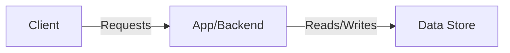

# Threat Model Template

## Scope
- System/feature:
- In-scope assets/data:
- Out-of-scope:

## Trust Boundaries
- Boundary 1:
  - From:
  - To:
  - Why it matters:

## Data Flow (DFD)
Use bullet form or a Mermaid diagram.

## Threats & Mitigations
| ID | Threat (what/where) | STRIDE (if used) | Affected boundary | Impact | Likelihood | Control/Mitigation | Verification evidence |
|---|---|---|---|---|---|---|---|
| TM-1 |  |  |  |  |  |  |  |

## Prioritization
- Primary drivers: impact × likelihood (or your chosen scoring)
- Top mitigations backlog:

